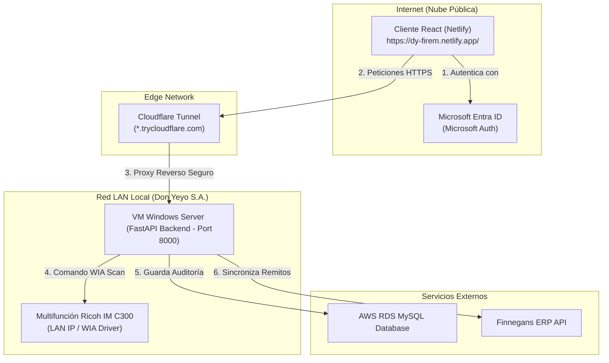
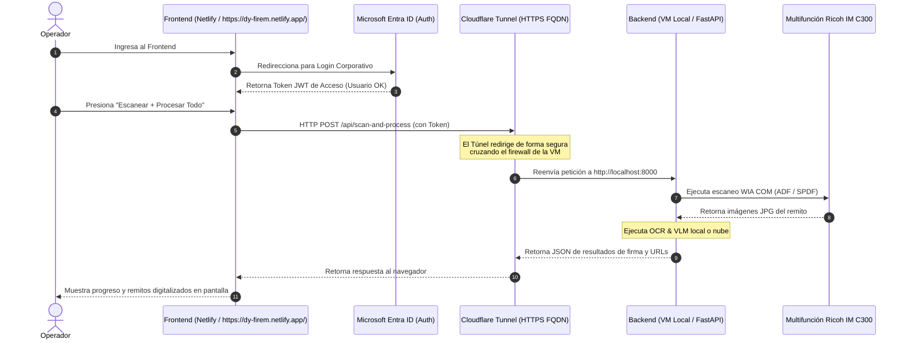

# Automatización de Recepción y Firma de Remitos - Don Yeyo

Este proyecto es una solución integral diseñada para agilizar y digitalizar el proceso de **control y auditoría de remitos firmados** en **Don Yeyo**. 

La aplicación permite realizar el escaneo masivo de remitos en papel utilizando el alimentador automático de hojas (ADF) de la impresora multifunción de la red local (ej. **RICOH IM C300**) y, posteriormente, procesar de manera automática las imágenes resultantes mediante Inteligencia Artificial (IA) y visión artificial (**MediaPipe**, **OpenCV**, o **VLMs** locales/nube) para detectar si los remitos han sido debidamente conformados (firmados y fechados).

---

## ¿Cómo ayuda a agilizar procesos en Don Yeyo?

El flujo de control de remitos tradicional requiere la revisión visual manual de cada hoja firmada por el cliente antes de ser archivada. Este proyecto automatiza este cuello de botella operativo introduciendo las siguientes mejoras:

*   **Auditoría Veloz y Masiva**: El operador coloca el fajo de remitos en la bandeja ADF del escáner Ricoh y el sistema los procesa consecutivamente sin intervención manual adicional.
*   **Detección Automatizada de Firmas**: En segundos, el sistema analiza cada imagen y determina automáticamente si el remito está firmado, reduciendo el error humano y la fatiga en la revisión.
*   **Integración con Sistemas de Información**: Los remitos escaneados y los resultados analizados por IA se suben de forma estructurada a **SharePoint**, se registran en una base de datos centralizada **MySQL (en AWS)** y se genera un reporte log en **CSV** para control del sector administrativo.
*   **Optimización del Espacio**: Permite deshacerse o archivar pasivamente el papel físico sabiendo que los documentos digitalizados y su validación constan en registros digitales seguros y fáciles de buscar.

---

## Ventajas Clave

1. **Resiliencia Operativa**: Si la bandeja ADF física del escáner se atasca o falla en red, el programa reintenta la conexión de forma autónoma hasta 3 veces y ofrece redirección rápida al panel plano (Flatbed).
2. **IA Híbrida y Flexible**: El motor de reconocimiento puede configurarse para usar modelos en la nube (como **Google Gemini**) para máxima precisión, o modelos locales offline (como **Ollama con Qwen2.5-VL**) para mayor privacidad y evitar costos de internet.
3. **Control Total del Dispositivo**: Permite cambiar la resolución (DPI), origen del papel (ADF/Plana) y el formato (JPG/PNG) de los archivos finales directamente desde el archivo `.env`.
4. **Instalación Integrada**: Cuenta con un menú interactivo que simplifica la instalación del motor OCR y los controladores de red necesarios en cualquier PC de la oficina.

---

## Funcionalidades y Mejoras Recientes

La plataforma ha evolucionado sumando robustez administrativa y de auditoría mediante las siguientes implementaciones:

### 1. 📊 Dashboard de Métricas y Control
*   **KPIs en Tiempo Real**: Tarjetas analíticas con cálculos del volumen de remitos totales, firmas conformadas, porcentaje de eficiencia de entrega, alertas y reclamos enviados.
*   **Top 10 de Clientes Deudores**: Listado inteligente que agrupa a los clientes deudores de firmas utilizando los primeros 30 caracteres de su razón social. Esto consolida de manera automática sucursales operativas pertenecientes a una misma entidad (por ejemplo, sucursales de *"Cooperativa Obrera"*), informando de forma verídica quién posee deudas de firmas. Incluye tratamiento de valores `NULL` en base de datos para no omitir comprobantes recién ingresados.

### 2. 📱 Interfaz Responsiva Adaptable (Mobile First)
*   **Historial Optimizado**: Grilla del historial de remitos totalmente rediseñada para celulares y tablets.
*   **Ocultamiento Inteligente**: Oculta columnas de menor prioridad (Transacción ID, Fecha de Emisión, Ejemplares) en pantallas con un ancho inferior a 768px, manteniéndolas accesibles y editables a través de la Ficha de Detalle (icono de lápiz) de cada comprobante.

### 3. 📧 Flujo Interactivo de Reclamo de Firmas
*   **Integración con Finnegans ERP**: Mediante la API de clientes, el sistema resuelve automáticamente en tiempo real los correos electrónicos del cliente a partir de su código, utilizándolos como destinatarios principales.
*   **Pantalla Completa de Preparación de Campañas**: Al presionar *"Enviar Reclamos"*, la aplicación pasa a una pantalla dedicada y limpia sin elementos flotantes:
    *   **Envío Único**: Permite editar destinatarios principales, destinatarios en copia (CC definidos en la variable de entorno `EMAIL_DESTINATARIOS`), el Asunto y el código HTML del cuerpo del correo. Cuenta con solapas para alternar entre "Código editable" (HTML) y "Vista previa" (un iframe que renderiza el email en tiempo real).
    *   **Envío Masivo (Bulk)**: Previsualiza el borrador genérico con comodines (`{{CLIENTE}}`, `{{NUMERO_REMITO}}`, `{{IMPORTE}}`) y deshabilita la edición manual de la casilla de destinatarios mostrando el comodín `{emails_extraidos_del_cliente}` (para evitar envíos cruzados accidentales). Al confirmar, el backend procesa de forma individual cada correo resolviendo sus emails desde Finnegans ERP y despachando los SMTP.
    *   **Leyenda de Plantilla**: Indica de forma sutil la ruta física del archivo base del servidor (`server/templates/reclamo_template.html`).

### 4. 🔍 Visualizador de Comprobantes Escaneados
*   **Pantalla Completa Dedicada**: Permite visualizar la imagen digitalizada del remito en un contenedor limpio.
*   **Control de Zoom**: Incluye controles interactivos para ampliar (`+`), reducir (`-`) y restaurar la escala original (`100%`) de la imagen.
*   **Detección de Enlaces SharePoint**: Identifica si la ruta del remito escaneado es una dirección web absoluta (por ejemplo, a SharePoint) sirviéndola de forma directa sin anteponerle la URL del servidor local de desarrollo.
*   **Despacho SMTP con Copias CC**: Permite enviar el escaneo al cliente, precargando de forma automática sus correos desde Finnegans ERP, y enviando copia (CC) a los correos definidos en la variable `EMAIL_DESTINATARIOS`.

### 5. 🔀 Ordenamiento desde el Servidor (Server-Side Sorting)
*   **Cabeceras Clickeables**: Permite ordenar de forma alfabética ascendente o descendente cada columna del historial haciendo clic en los títulos.
*   **Seguridad SQL**: Las peticiones pasan parámetros `sort_field` y `sort_dir`. El backend valida y mapea estos campos contra una lista blanca cerrada de columnas MySQL antes de construir la consulta, eliminando todo riesgo de inyección de código SQL.

### 6. 🛠️ Robustez del Backend (Concurrencia en DualStream)
*   **Seguridad Multihilo**: Implementación de controles preventivos en el gestor `DualStream` para evitar excepciones `AttributeError` cuando hilos secundarios (como trabajadores de correos SMTP en background) escriben en consola después de que el hilo principal haya finalizado y cerrado el log físico del proceso actual.

---

## Estructura del Proyecto

El proyecto sigue una arquitectura **cliente/servidor desacoplada** optimizada para despliegues locales rápidos en PC/VM y publicación de frontend en la nube (Netlify):

```text
dy_firma_remitos/
├── client/                 # Aplicación Frontend React + Vite + MSAL
│   ├── src/
│   │   ├── config/         # Configuración de MSAL Azure AD y AuthContext
│   │   ├── App.jsx         # Dashboard móvil con consola virtual y logs
│   │   └── index.css       # Estilos Glassmorphism Premium (Tema Oscuro)
│   ├── .env                # Variables de Azure AD para desarrollo
│   └── .env.template       # Plantilla de variables del cliente
├── server/                 # Servidor Backend Python + FastAPI
│   ├── server.py           # API REST con captura de logs en vivo (stdout)
│   ├── config.py           # Carga de variables de entorno locales
│   ├── scanner.py          # Integración WIA y control físico del escáner
│   ├── recognition.py      # Análisis de imágenes y auditoría por IA
│   ├── sync_remitos.py     # Módulo de sincronización con Finnegans ERP
│   ├── build_exe.bat       # Script para compilar el backend a ejecutable .exe
│   ├── requirements.txt    # Librerías Python requeridas (con FastAPI/PyInstaller)
│   ├── .env                # Configuración de red y base de datos (oculto en Git)
│   └── .env.template       # Plantilla de variables del servidor
├── package.json            # Scripts de orquestación de desarrollo concurrente
├── netlify.toml            # Configuración de despliegue del cliente en Netlify
└── README.md
```

---

## 🗺️ Arquitectura de Red y Flujo de Despliegue

El proyecto se despliega bajo una topología híbrida para sortear las restricciones del Firewall corporativo y permitir el control remoto del hardware LAN desde la nube pública:

### Diagrama de Arquitectura Física y Conectividad



### Diagrama de Secuencia: Autenticación e Integración de Firma



---

## 🌐 Diagnóstico y Conectividad con Cloudflare Tunnel

### ¿Por qué mi URL del túnel devuelve "Not Found"?
Si al visitar el dominio configurado en Netlify (ej. `https://regard-refused-reservation-kennedy.trycloudflare.com`) se muestra un error **Not Found (404)** o **Bad Gateway (502)**, esto ocurre debido a dos razones principales:

1. **El túnel es efímero y expiró**: Al ejecutar `cloudflared.exe tunnel --url http://localhost:8000` de forma rápida sin una cuenta de Cloudflare, se genera un subdominio temporal en `trycloudflare.com`. Cada vez que el túnel se detiene y se vuelve a iniciar en la VM local, **el subdominio previo es destruido** y Cloudflare genera uno completamente aleatorio nuevo (como `https://hobbies-focus-step-outsourcing.trycloudflare.com`).
2. **El backend local no está corriendo**: Si el túnel de Cloudflare está activo pero el servidor FastAPI no está ejecutándose localmente en la VM (puerto `8000`), Cloudflare no encontrará dónde redirigir el tráfico y arrojará error.

### Paso a Paso para Reactivar el Canal Efímero en la VM:
1. **Levantar el Backend**: Abra una terminal en la VM de Windows Server, navegue a la carpeta del proyecto y levante el servidor FastAPI local:
   ```powershell
   uv run python server/server.py
   ```
2. **Iniciar el Túnel**: Abra otra terminal en la VM (donde tenga descargado el archivo `cloudflared.exe`) y levante el túnel efímero apuntando al puerto local `8000`:
   ```powershell
   .\cloudflared.exe tunnel --url http://localhost:8000
   ```
3. **Copiar la Nueva URL**: Ubique la línea en los logs de consola de Cloudflare que indica:
   `Your quick Tunnel has been created! Visit it at: https://xxxx-xxxx-xxxx.trycloudflare.com`
4. **Configurar Netlify**:
   * Ingrese al panel administrativo de Netlify de la app (`https://dy-firem.netlify.app/`).
   * Vaya a **Site Configuration** → **Environment variables**.
   * Modifique la variable `VITE_API_URL` ingresando la nueva URL obtenida (ej. `https://xxxx-xxxx-xxxx.trycloudflare.com`).
   * **IMPORTANTE**: Guarde los cambios y ejecute un redespliegue de la aplicación (Deploy Site) para que los archivos estáticos de React compilen con la nueva IP del backend.

---

### 🔒 Cómo crear un Túnel Persistente (Named Tunnel) y Fijo

Para evitar tener que reconfigurar la URL en Netlify y reiniciar el despliegue del frontend tras cada reinicio de la VM, puedes configurar un túnel persistente y asociarlo a un subdominio fijo (por ejemplo: `remitos-api.donyeyo.com.ar`).

#### Opción A: Configuración Automática (Recomendada)
Se provee un script interactivo de PowerShell en la raíz del proyecto para automatizar todo el proceso:
1. Abre **PowerShell como Administrador** en la VM.
2. Navega a la raíz del proyecto y ejecuta el script:
   ```powershell
   Set-ExecutionPolicy Bypass -Scope Process -Force
   .\setup_cloudflare_tunnel.ps1
   ```
3. El script guiará el inicio de sesión, solicitará el subdominio, creará el túnel nombrado `dy-remitos-tunnel`, generará el archivo `config.yml` con el UUID en `C:\Users\Administrador\.cloudflared\`, creará el registro CNAME en las DNS de Cloudflare y dejará el túnel instalado y corriendo como un Servicio de Windows automático de fondo.

---

#### Opción B: Configuración Manual Paso a Paso
En caso de requerir configuración manual, realiza los siguientes pasos en la VM:

##### 1. Descarga e inicio de sesión:
* Descarga la última versión de `cloudflared.exe` en la VM desde:
  - **Enlace directo de GitHub (Windows 64-bit)**: [Descargar cloudflared-windows-amd64.exe](https://github.com/cloudflare/cloudflared/releases/latest/download/cloudflared-windows-amd64.exe)
  - **Listado completo de versiones**: [GitHub Releases Assets](https://github.com/cloudflare/cloudflared/releases/latest)
  - **Alternativa mediante winget** (desde PowerShell de la VM):
    ```powershell
    winget install -e --id Cloudflare.cloudflared
    ```
* Corre en la consola de la VM (dependiendo de qué consola uses):
  ```bash
  # Si usas Git Bash / MINGW64 (recuerda usar barra inclinada /):
  ../cloudflared.exe tunnel login    # si está en la carpeta de nivel superior
  
  # Si usas PowerShell / CMD (barra invertida \):
  ..\cloudflared.exe tunnel login
  ```
* Se abrirá el navegador. Inicia sesión con la cuenta de Cloudflare de la empresa y selecciona el dominio que deseas autorizar (ej. `donyeyo.com.ar`). Esto descargará el certificado criptográfico de autorización `cert.pem` en tu máquina.

##### 2. Crear el Túnel Nombrado:
* Crea el túnel ejecutando el siguiente comando (puedes ponerle el nombre que quieras):
  ```bash
  # En Git Bash:
  ../cloudflared.exe tunnel create dy-remitos-tunnel
  
  # En PowerShell / CMD:
  ..\cloudflared.exe tunnel create dy-remitos-tunnel
  ```
* Copia el **UUID/ID único del túnel** generado (un string con guiones como `550e8400-e29b-41d4-a716-446655440000`) y la ruta al archivo JSON de credenciales creado en tu perfil de usuario de Windows.

##### 3. Configurar el archivo de mapeo (config.yml):
* Crea un archivo llamado `config.yml` en la carpeta donde tienes `cloudflared.exe` (o en `C:\Users\Administrador\.cloudflared\`) con el siguiente formato:
  ```yaml
  tunnel: <UUID-DEL-TUNEL>
  credentials-file: C:\Users\Administrador\.cloudflared\<UUID-DEL-TUNEL>.json

  ingress:
    - hostname: remitos-api.donyeyo.com.ar
      service: http://localhost:8000
    - service: http_status:404
  ```

##### 4. Crear la ruta DNS en el panel de Cloudflare:
* Asocia el subdominio con el túnel ejecutando:
  ```bash
  # En Git Bash:
  ../cloudflared.exe tunnel route dns dy-remitos-tunnel remitos-api.donyeyo.com.ar

  # En PowerShell / CMD:
  ..\cloudflared.exe tunnel route dns dy-remitos-tunnel remitos-api.donyeyo.com.ar
  ```
* Esto generará de forma automática el registro CNAME seguro en las DNS de tu dominio en Cloudflare.

##### 5. Probar e Instalar como Servicio de Windows (Arranque Automático Desatendido):
* **Prueba manual en consola**:
  Para probar el túnel manualmente en la terminal de la VM, debes pasarle explícitamente la ruta al archivo de configuración (`config.yml`). De lo contrario, `cloudflared` buscará en ubicaciones por defecto, no leerá las Ingress Rules de redirección al puerto `8000` y retornará un error 503 (No ingress rules defined):
  ```bash
  # En Git Bash:
  ../cloudflared.exe --config C:/Users/Administrador/.cloudflared/config.yml tunnel run dy-remitos-tunnel
  
  # En PowerShell / CMD:
  ..\cloudflared.exe --config C:\Users\Administrador\.cloudflared\config.yml tunnel run dy-remitos-tunnel
  ```
* **Instalar el servicio de Windows**:
  Para que el túnel se inicie de fondo al encender la VM de Windows Server de forma automática, registra el servicio pasándole el archivo de configuración:
  ```powershell
  # Instalar servicio con config explícita (Ejecutar PowerShell como Administrador):
  ..\cloudflared.exe --config C:\Users\Administrador\.cloudflared\config.yml service install
  ```
  > [!NOTE]
  > Al correr como servicio bajo la cuenta de sistema `SYSTEM` (`LocalSystem`), Cloudflare busca las credenciales en el home del sistema. El comando de instalación copia los archivos correspondientes allí de forma automática. Si encuentras errores de ruteo al iniciar el servicio, asegúrate de copiar manualmente los archivos `config.yml` y `ff8b5686-1d34-4d8b-a2ee-83ef0a447b11.json` dentro del directorio:
  > `C:\Windows\System32\config\systemprofile\.cloudflared\`

* **Iniciar el servicio**:
  ```powershell
  Start-Service "Cloudflared"
  ```

---

### 🛡️ Soluciones de Compatibilidad de Autenticación (Bypass local HTTP)

Durante el despliegue local y de red LAN en la VM (`http://192.168.1.123:8000/`), se implementaron las siguientes mitigaciones para saltar limitaciones de seguridad de los navegadores modernos:

1. **Bypass del error `crypto_nonexistent`**:
   * **Causa**: La biblioteca de autenticación de Azure AD (MSAL.js) requiere que la Web Crypto API (`window.crypto`) esté disponible en el navegador. Por directivas de seguridad de Google Chrome/Edge/Safari, `window.crypto` **solo está disponible en contextos seguros** (HTTPS o localhost). Al entrar al backend usando la IP local de red (`http://192.168.1.123:8000/`), el navegador deshabilita `window.crypto` y MSAL.js arrojaba una excepción fatal no controlada que dejaba la pantalla en blanco.
   * **Mitigación**: Se envolvió la instanciación de MSAL.js (`new PublicClientApplication`) en un bloque `try/catch`. En caso de capturar el error criptográfico, la aplicación se autoconfigura con un **Proxy de JavaScript** de compatibilidad. Este proxy intercepta dinámicamente cualquier llamada a métodos internos de MSAL (como `initializeWrapperLibrary`, `getLogger`, `clone` y clientes de navegación) y retorna funciones seguras vacías en lugar de lanzar excepciones de tipo `TypeError`.

2. **Habilitación de Bypass de Mock en Producción (VM)**:
   * **Causa**: Inicialmente el bypass de autenticación simulada (para operadores de escáner en red local sin conexión a internet) estaba restringido al entorno local de desarrollo (`DEV`). En la VM Server el frontend se sirve compilado bajo producción, por lo que ignoraba el mock e intentaba forzar la autenticación real contra Microsoft, arrojando advertencias en la IP LAN.
   * **Mitigación**: Se liberó la restricción en `AuthContext.jsx`. Ahora, siempre que configures la variable de entorno `VITE_MOCK_AUTH=true` en tu archivo `.env`, la aplicación utilizará la autenticación simulada con el correo de `VITE_MOCK_AUTH_EMAIL` tanto en desarrollo como en la compilación de producción de la VM.

---

## ⏰ Tarea Programada de Windows (Sincronización ERP 3:00 AM)

Para realizar la descarga y sincronización de remitos facturados desde Finnegans ERP todas las noches de fondo, se provee un script automatizado para la VM local:

1. **Uso del script de autoinstalación**:
   * Busque el archivo [create_scheduled_task.bat](file:///c:/Users/gabrielt/Documents/Proyectos/Automatizaci%C3%B3nFirmaRemitos/dy_firma_remitos/create_scheduled_task.bat) en la raíz del proyecto.
   * Haga clic derecho sobre él y seleccione **Ejecutar como Administrador**.
   * El script detectará dinámicamente la ruta de la VM en la que se encuentra instalado el proyecto y registrará una tarea programada llamada `Sincronizador Remitos Don Yeyo` bajo el usuario del sistema `SYSTEM`.
2. **Verificación**:
   * Puede abrir el *Programador de Tareas* (`taskschd.msc`) de Windows Server y validar que la tarea figure activa para ejecutarse a las **03:00 AM** diariamente de forma desatendida y sin ventana de consola visible.
   * Los registros de auditoría de este proceso se guardan diariamente en `server/logs/sync_remitos.log`.

---

## 🐳 Despliegue mediante Docker (Referencia Teórica)

> [!WARNING]
> La máquina virtual (VM) actual con Windows Server **no cuenta con soporte para Docker** debido a limitaciones físicas del sistema operativo de la oficina y la imposibilidad de activar virtualización anidada o WSL2. El despliegue de Python nativo descrito en la sección de VM es el método productivo actual.

En caso de migrar a una infraestructura en la nube o VM compatible en el futuro, se detalla el flujo de Dockerización:

### Dockerfile del Backend (`server/Dockerfile`)
```dockerfile
FROM python:3.10-slim

# Instalar Tesseract OCR y dependencias del sistema
RUN apt-get update && apt-get install -y \
    tesseract-ocr \
    tesseract-ocr-spa \
    libgl1-mesa-glx \
    libglib2.0-0 \
    && rm -rf /var/lib/apt/lists/*

WORKDIR /app
COPY requirements.txt .
RUN pip install --no-cache-dir -r requirements.txt

COPY . .

EXPOSE 8000
CMD ["python", "server.py"]
```

### Docker Compose de Referencia (`docker-compose.yml`)
```yaml
version: '3.8'

services:
  backend:
    build:
      context: ./server
    ports:
      - "8000:8000"
    environment:
      - DB_HOST=dydb2-instance-1...rds.amazonaws.com
      - DB_NAME=Firma_de_remitos
      - AI_PROVIDER=gemini
    volumes:
      - ./server/scanned_documents:/app/scanned_documents
      - ./server/logs:/app/logs

  frontend:
    image: node:18-alpine
    working_dir: /app
    volumes:
      - ./client:/app
    ports:
      - "5173:5173"
    command: sh -c "npm install && npm run dev -- --host"
    environment:
      - VITE_API_URL=http://backend:8000
```

---

## Requisitos Previos

### 1. Sistema Operativo y Python
- **Windows** (requerido para el módulo COM WIA).
- **Python 3.10** o superior (se recomienda **Python 3.10** debido a compatibilidad estricta de versiones anteriores de MediaPipe y TensorFlow en Windows).

### 2. Driver WIA de la Multifunción RICOH IM C300

Para que Windows reconozca el escáner a través de la red, existen **dos tipos de drivers WIA**:

#### A. Driver Nativo WSD de Ricoh (✔ Recomendado tras configurar la web de la impresora)
- Se instala automáticamente cuando Windows detecta la impresora en la red vía WSD (Web Services for Devices) y aparece como **"RICOH IM C300"** en el sistema.
- **IMPORTANTE: Habilitación de Digitalización WSD en la fotocopiadora**:
  Por seguridad, las Ricoh tienen el escaneo WSD remoto bloqueado de fábrica. Para habilitarlo, siga estos pasos:
  1. Abra un navegador web e ingrese a la dirección IP de la impresora: `http://192.168.1.54/` (Web Image Monitor).
  2. Haga clic en **Iniciar sesión** (Login) arriba a la derecha.
     * **Usuario**: `admin`
     * **Contraseña**: *dejar en blanco* (vacía por defecto).
  3. En el menú lateral izquierdo, vaya a **Gestión del dispositivo** (Device Management) → **Configuración** (Configuration).
  4. En la sección **Escáner** (Scanner), haga clic en **Ajustes iniciales** (Initial Settings).
  5. Busque la opción **Utilizar WSD o DSM** (Use WSD or DSM) y seleccione **WSD**.
  6. En la misma pantalla, ubique la sección **Prohibir comando esc. WSD** (Prohibit WSD Scan command / Wsd Reading) y seleccione la opción **Permitir** o **No prohibir** (Permit / Wsd Reading Permission).
  7. Presione **Aceptar** (OK) para guardar y aplicar los cambios.

Una vez configurado, este es el mejor driver ya que controla el alimentador de hojas automático (SPDF) nativamente sin incompatibilidades.

#### B. Driver Network WIA de Ricoh (Alternativa directa por IP)
- Se conecta **directamente por IP** al escáner, sin pasar por el protocolo WSD.
- Aparece como **"Type Generic Scanner(Network) WIA"** en la lista de dispositivos.
- Se puede usar como alternativa en caso de que WSD falle.

**Instalación del Driver Network WIA:**

1. **Desde el menú interactivo** (Opción 1): Seleccione el archivo `Setup.inf` del driver Network WIA. El programa ejecutará `pnputil` con elevación UAC y abrirá el panel de Escáneres y Cámaras automáticamente.

2. **Manual desde PowerShell (Administrador)**:
   ```powershell
   # Paso 1: Agregar el driver al almacén de Windows
   pnputil /add-driver "drivers_win\Network WIA Driver scanner_z06624L20_WIA\Network\Setup.inf" /install

   # Paso 2: Abrir el panel de Escáneres y Cámaras para agregar el dispositivo
   rundll32 shell32.dll,Control_RunDLL sticpl.cpl
   ```
   En el panel: clic en **Agregar** → seleccionar **"Type Generic Scanner(Network) WIA"** → ingresar la IP del escáner (`192.168.1.54`).

3. **Verificar**: Ejecutar `python main.py`, Opción 2 para ver si el nuevo escáner aparece listado. Seleccionarlo para que quede guardado en `.env`.

### 3. Motor de Reconocimiento Óptico de Caracteres (Tesseract OCR)
Para habilitar el paso 2 de extracción de textos locales del documento e incluirlos de forma estructurada en el JSON:
1. **Instalación de Tesseract OCR**:
   * **Instalador local**: Podés ejecutar directamente el instalador oficial incluido en el proyecto en `drivers_win/tesseract-ocr-w64-setup-5.5.0.20241111.exe`.
   * **Alternativa de descarga**: Si preferís descargar una versión más reciente, podés obtenerla desde [UB Mannheim GitHub Wiki](https://github.com/UB-Mannheim/tesseract/wiki).
2. **IMPORTANTE**: Durante la instalación, en el paso de selección de componentes, despliegue la sección **"Additional language data"** (Datos de idioma adicionales) y marque la opción **"Spanish"** (español) para habilitar el reconocimiento correcto de tildes y caracteres en español. También asegúrese de tener marcado "English".
3. **Instalación de Drivers Ricoh WIA**:
   * **Controlador local**: Podés instalar el driver oficial incluido en el proyecto desde `drivers_win/Network WIA Driver scanner_z06624L20_WIA/`.
   * **Alternativa de descarga**: También podés obtenerlo desde el portal oficial de Ricoh para tu modelo de multifunción (ej. Ricoh IM C300).

---


## Instalación

1. **Clonar o abrir el directorio del proyecto**.
2. **Crear el entorno virtual con uv** (usando Python 3.10):
   ```powershell
   uv venv --python 3.10
   ```
3. **Instalar las dependencias**:
   ```powershell
   uv pip install -r requirements.txt
   ```
4. **Configurar las variables de entorno**:
   Copie el archivo `.env.template` a `.env` y edite las variables si es necesario:
   ```powershell
   copy .env.template .env
   ```

---

## Uso del Programa

Ejecute el script principal usando el cargador de `uv`:
```powershell
uv run python main.py
```


Se presentará un menú interactivo en español con las siguientes opciones:

### 1. Instalar controladores (impresora/escáner WIA)
Escanea la carpeta `drivers_win/` en busca de instaladores ejecutables (`.exe`) o archivos de controlador (`.inf`). Al seleccionar uno:
- **Archivos `.inf`**: Ejecuta `pnputil /add-driver` con elevación UAC para agregarlo al almacén de controladores de Windows, y luego abre automáticamente el panel de **Escáneres y Cámaras** (`sticpl.cpl`) para completar la configuración del dispositivo de red.
- **Archivos `.exe`**: Lanza el instalador gráfico del fabricante.

### 2. Seleccionar escáneres/multifunciones del sistema (WIA)
Muestra los escáneres compatibles con WIA instalados en Windows. Al elegir el número correspondiente a tu Ricoh, se guardará automáticamente en el archivo `.env` en la variable `SCANNER_NAME` y se correrá un test de conexión de red rápido.

### 3. Enviar página de prueba de impresión
Dispara la página de prueba oficial del controlador en Windows para la impresora configurada en `SCANNER_NAME`. Esto permite comprobar que el canal físico de impresión funciona correctamente.

### 4. Iniciar Escaneo Masivo (Paso 1 - Bandeja/ADF)
Dispara la bandeja de alimentación automática (ADF) de la multifunción. Escanea de forma consecutiva todas las páginas cargadas y las almacena en la carpeta especificada en `.env` (por defecto `scanned_documents/`).

**Resiliencia ante errores:**
- Si el ADF falla con `E_FAIL`, el sistema reintenta hasta **3 veces** reconectándose al dispositivo WIA entre cada intento.
- Si persiste el error, ofrece un menú interactivo para: reintentar, cambiar a **modo Flatbed (vidrio)** o abortar.

### 5. Procesar Imágenes Escaneadas (Paso 2 - IA)
Analiza las imágenes de la carpeta de escaneo usando un modelo de lenguaje visual (VLM) o un flujo de automatización en la nube. Soporta tres proveedores de inteligencia:
- **Gemini AI** (nube): Requiere `GEMINI_API_KEY` en `.env`. Utiliza los modelos de lenguaje multimodal de Google en la nube.
- **Ollama Local** / **VLM Local**: Requiere Ollama o vLLM corriendo localmente con el modelo de visión configurado en `VLM_MODEL`.
- **Power Automate Nube + AI Builder (Recomendado Corporativo)**:
  * Convierte la imagen escaneada local a formato **Base64** y la transmite mediante una petición HTTP POST a un flujo de Power Automate en la nube (`POWERAUTOMATE_URL`).
  * El flujo de Power Automate utiliza **Microsoft AI Builder** como cerebro de visión artificial para analizar el documento y extraer la confirmación de la firma de manera estructurada.
  * El flujo retorna los resultados y guarda el remito en el servidor de SharePoint.
  * El script de Python recibe el resultado, decodifica el path de SharePoint y, utilizando la variable `SHAREPOINT_FQDN`, genera y formatea de forma automática la **URL directa y pública al remito archivado en SharePoint** (preservando los espacios y caracteres especiales de la ruta).

### 6. Escanear + Procesar Todo (Flujo Completo)
Esta opción automatiza de punta a punta todo el proceso de digitalización y auditoría:
1. Dispara el **Paso 1 (Escaneo Masivo)** para jalar las hojas de la bandeja superior de la Ricoh.
2. Si el escaneo finalizó con éxito y se generaron imágenes en la carpeta local, inicia de forma automática y secuencial el **Paso 2 (Procesamiento por IA)**, analizando las firmas y sellos y actualizando la base de datos de AWS y SharePoint sin requerir intervención o clics adicionales por parte del operador.

### 7. Sincronizar Remitos desde Finnegans (ERP)
Ejecuta de manera inmediata la lógica de sincronización del script `sync_remitos.py` desde el menú principal. Conecta a la API de Finnegans, descarga el reporte `AFIRMAREMVEN_MG` y actualiza/inserta los remitos correspondientes en la base de datos de AWS MySQL, informando del progreso paso a paso por consola.

### 8. Mostrar Configuración Actual (.env)
Imprime en pantalla los parámetros con los que está operando el sistema actualmente (DPI, Color, Formato, etc.).

### 9. Gestionar Servicio Ollama (VLM Local)
Submenú para iniciar, detener, verificar estado del servidor Ollama y liberar memoria RAM/VRAM.

---

## Personalización y Variables de Entorno (.env)

| Variable | Descripción | Valores de Ejemplo |
| :--- | :--- | :--- |
| `SCANNER_NAME` | Nombre o parte del nombre de la impresora multifunción | `RICOH IM C300` |
| `SCAN_OUTPUT_DIR` | Directorio donde se guardarán las imágenes | `scanned_documents` |
| `SCAN_DPI` | Resolución del escaneo | `150`, `200`, `300` |
| `SCAN_COLOR_MODE` | Formato de color | `1` (Color), `2` (Grises), `4` (B&N) |
| `SCAN_FORMAT` | Formato de archivo de imagen | `JPG`, `PNG`, `TIFF` |
| `SCAN_SOURCE` | Alimentador automático o cama plana | `ADF` o `FLATBED` |
| `SCAN_ADF_DELAY` | Tiempo de espera entre páginas en el alimentador (segundos) | `2.5` |
| `SCAN_FILE_WRITE_DELAY` | Tiempo de espera para liberar descriptor del archivo (segundos) | `0.5` |
| `AI_PROVIDER` | Proveedor de IA o servicio para procesamiento | `gemini`, `local` o `powerautomate` |
| `VLM_MODEL` | Modelo de VLM local para Ollama | `qwen2.5vl:7b` |
| `GEMINI_API_KEY` | Clave API de Google Gemini | `AIza...` |
| `POWERAUTOMATE_URL` | URL del flujo de Power Automate a invocar | `https://.../workflows/...` |
| `SHAREPOINT_FQDN` | FQDN del SharePoint para formatear la ruta del archivo | `https://donyeyosa416.sharepoint.com/:i:/r/sites/Administracin` |
| `DB_HOST` | Servidor MySQL en la nube (AWS RDS) | `dydb2-instance-1...rds.amazonaws.com` |
| `DB_NAME` | Nombre de la base de datos MySQL | `Firma_de_remitos` |
| `DB_USER` | Usuario de conexión de base de datos | `DBAdmin_Firma_de_Remitos` |
| `DB_PASSWORD` | Contraseña del usuario de base de datos | `********` |
| `FINNEGANS_CLIENT_ID` | Identificador de cliente para la API de Finnegans | `859744933f6e25e1...` |
| `FINNEGANS_CLIENT_SECRET` | Clave secreta para la API de Finnegans | `aea5d0380ec3b659...` |
| `FINNEGANS_EMPRESA_COD` | Código de empresa dentro de Finnegans | `EMPRE01` |
| `FINNEGANS_HTTP_TIMEOUT` | Tiempo de espera límite para respuestas de reportes en Finnegans | `90` |
| `SYNC_DAYS_BACK` | Ventana de días hacia atrás a sincronizar en ejecuciones automáticas | `7` |

---

## Sincronización Automática (Tarea Programada de Windows)

El proyecto incluye una integración automatizada para extraer remitos directamente del ERP de Finnegans e insertarlos en la base de datos de auditoría de remitos de Don Yeyo de forma periódica.

### Ejecución Manual o bajo Demanda
Puedes lanzar la sincronización de forma manual desde la terminal con las dependencias cargadas en tu entorno virtual:
```powershell
# Ejecución automática (busca la ventana de días configurada en SYNC_DAYS_BACK)
uv run python sync_remitos.py

# Reprocesamiento manual con rango de fechas específico (YYYY-MM-DD)
uv run python sync_remitos.py --desde 2026-07-01 --hasta 2026-07-15
```

### Configuración del Cron / Tarea Programada en Windows

Para que el proceso se ejecute de manera desatendida y automática de fondo (por ejemplo, cada hora o todas las mañanas):

1. **El archivo ejecutable (.bat)**: El proyecto cuenta con [sync_remitos.bat](file:///c:/Users/gabrielt/Documents/Proyectos/Automatizaci%C3%B3nFirmaRemitos/dy_firma_remitos/sync_remitos.bat) en el directorio raíz. Este archivo se encarga de posicionarse en la carpeta correcta, detectar el entorno virtual Python `.venv` y lanzar el script sin necesidad de intervención visual.
2. **Programador de Tareas de Windows**:
   * Abre el **Programador de Tareas** (`taskschd.msc`) desde el menú de inicio de Windows.
   * Haz clic en **Crear Tarea Básica...** en el panel de acciones.
   * Dale un nombre (ej. `Sincronizador Remitos Don Yeyo`) y descripción.
   * Selecciona el desencadenador (ej. **Diariamente** o **Al iniciar el equipo**).
   * En la acción, selecciona **Iniciar un programa**.
   * En el campo **Programa o script**, ingresa la ruta completa a tu archivo `.bat`, por ejemplo:
     `C:\Users\gabrielt\Documents\Proyectos\AutomatizaciónFirmaRemitos\dy_firma_remitos\sync_remitos.bat`
   * **IMPORTANTE**: En el campo **Iniciar en (opcional)**, ingresa la ruta absoluta de la carpeta del proyecto:
     `C:\Users\gabrielt\Documents\Proyectos\AutomatizaciónFirmaRemitos\dy_firma_remitos`
   * Haz clic en finalizar.

Los logs de sincronización se guardarán en la carpeta `logs/sync_remitos.log` de forma local para control administrativo.

---

## 🌐 Arquitectura Web Móvil (Netlify + Servidor local)

Para facilitar la operatoria diaria estando físicamente parados frente a la multifunción Ricoh, el sistema cuenta con un frontend móvil responsivo accesible desde celulares y un backend local que se comunica con el escáner.

### 💻 1. Ejecutar en Desarrollo Concurrente
Para programar o validar cambios en la PC de desarrollo:
1. Instale las dependencias del frontend:
   ```bash
   npm run install-all
   ```
2. Inicie ambos servicios concurrentemente (Vite + FastAPI):
   ```bash
   npm run dev
   ```
    * El frontend estará accesible en `https://localhost:5173` (se utiliza un certificado de desarrollo SSL autofirmado para habilitar la Web Crypto API requerida por MSAL.js).
    * El backend API estará escuchando en `http://localhost:8000`.

### 🚀 2. Desplegar el Frontend en Netlify
El cliente React está preparado para ser subido a Netlify en segundos:
1. Conecte el repositorio a Netlify.
2. Netlify detectará automáticamente el archivo [netlify.toml](file:///c:/Users/gabrielt/Documents/Proyectos/Automatizaci%C3%B3nFirmaRemitos/dy_firma_remitos/netlify.toml) en la raíz del proyecto.
3. Configure las variables de entorno de Azure AD en el panel de Netlify:
   * `VITE_AZURE_AD_CLIENT_ID`
   * `VITE_AZURE_AD_TENANT_ID`
   * `VITE_MOCK_AUTH` (Establecer a `false` en producción Netlify).

### 📦 3. Compilar el Servidor a Ejecutable `.exe` (PyInstaller)
Si desea correr el backend en cualquier notebook o máquina virtual (VM) de la LAN sin instalar Python:
1. Ejecute el archivo de lote:
   ```powershell
   .\server\build_exe.bat
   ```
2. Al finalizar, el ejecutable autocontenido se creará en la carpeta `dist_server/dy_remitos_server.exe`.
3. Mueva ese `.exe` junto con su archivo de configuración `.env` a la notebook o servidor de red local.
4. Ejecute el `.exe` con doble clic. Se abrirá una ventana de comandos de Windows mostrando la IP local de escucha (ej. `Uvicorn running on http://192.168.1.100:8000`).

### 📱 4. Conectar el celular al Servidor local en la LAN
1. Asegúrese de que el celular del operador esté conectado a la **misma red WiFi corporativa** que la notebook o VM servidor.
2. Ingrese a la URL de Netlify desde el celular.
3. Presione el ícono de **Configuración de Red (Rueda dentada)** arriba a la derecha.
4. Escriba la dirección IP de la notebook/VM servidor local que se muestra en la consola del `.exe` (ej: `http://192.168.1.100:8000`) y presione guardar.
5. ¡Listo! Ya puede disparar el escaneo masivo desde el celular parado junto a la Ricoh y ver el progreso en tiempo real.

### ⚙️ 5. Guía de Despliegue en VM Local (Producción)

Si vas a realizar el despliegue del servidor en una **Máquina Virtual (VM)** con Windows dentro de la red corporativa de la empresa (ej. con la IP `192.168.1.123`):

#### A. Habilitar Puerto en el Firewall de la VM
Windows Server o Windows 10 bloquean por defecto el puerto `8000`. Para permitir conexiones desde los celulares en el WiFi de la oficina, debés abrir el puerto.
* **Por comando (Recomendado)**: Abrí **PowerShell como Administrador** en la VM y ejecutá:
  ```powershell
  New-NetFirewallRule -DisplayName "Servidor Remitos API" -Direction Inbound -LocalPort 8000 -Protocol TCP -Action Allow
  ```
* **Por interfaz gráfica**:
  1. Abrí *Firewall de Windows con seguridad avanzada*.
  2. Hacé clic en *Reglas de entrada* y seleccioná *Nueva regla...*
  3. Elegí *Puerto*, TCP, *Puertos locales específicos:* `8000`.
  4. Seleccioná *Permitir la conexión* y dale un nombre (ej. `Servidor Remitos API`).

#### B. Despliegue del Frontend: Método 1 - En la Nube (Netlify)
Es ideal para centralizar el acceso público desde cualquier dispositivo móvil:
1. Subí la carpeta `/client` a Netlify.
2. En las configuraciones de Netlify, declara la variable de entorno para Netlify:
   `VITE_API_URL=http://192.168.1.123:8000`
3. **Restricción de Contenido Mixto (Mixed Content)**: Como Netlify corre bajo `https://` y la VM de la empresa bajo `http://`, los navegadores de los celulares (Chrome, Safari) bloquearán las peticiones por seguridad.
   * **Solución**: En el Chrome del celular, presioná el icono de ajustes/candado al lado de la barra de direcciones de Netlify, ingresá a *Configuración del sitio* y cambiá **Contenido no seguro** a **Permitir**.

#### C. Despliegue del Frontend: Método 2 - Autocontenido en la VM (✔ Altamente Recomendado)
Evita el despliegue en Netlify, elimina problemas de HTTPS/Mixed Content y funciona 100% local aunque se caiga el enlace de Internet:
1. Compilá el frontend localmente ejecutando en la raíz de tu proyecto:
   ```bash
   npm run build-client
   ```
   *Esto creará la carpeta estática lista para producción en `client/dist/`.*
2. El servidor de FastAPI (`server.py` o el `.exe` compilado) detectará automáticamente la existencia de esa carpeta al arrancar y **servirá tanto el Frontend como el Backend en el mismo puerto `8000`**.
3. El operador solo debe conectarse al WiFi corporativo e ingresar desde su celular directamente a:
   `http://192.168.1.123:8000`
   *(Al correr todo bajo HTTP y la misma IP, el navegador lo cargará al instante y sin restricciones de seguridad de ningún tipo).*

#### D. Levantar el Servidor en la VM usando Python Nativo (Sin usar el .exe)
Si la VM ya cuenta con Python instalado y preferís correr el servidor directamente con el intérprete de Python (en lugar de usar el ejecutable `.exe` compilado), seguí estos pasos:

1. **Copiar archivos**: Copiá la carpeta `/server` (y el archivo `.env` configurado dentro de ella) al directorio de la VM. Si usás el *Método 2 (autocontenido)*, también debés copiar la carpeta compilada `/client/dist` al mismo nivel jerárquico.
2. **Crear Entorno Virtual**: 
   * **Con Python nativo**: Abrí la terminal en la carpeta `/server` de la VM y ejecutá:
     ```bash
     python -m venv .venv
     ```
   * **Con `uv` (si está instalado)**: Si tenés `uv` instalado podés usarlo para mayor velocidad. Si te arroja el error `uv: command not found`, podés instalarlo primero con `pip install uv` y luego crear el entorno:
     ```bash
     uv venv --python 3.10
     ```
3. **Activar el Entorno**:
   * En Git Bash / MINGW64: `source .venv/Scripts/activate`
   * En CMD: `.venv\Scripts\activate.bat`
   * En PowerShell: `.venv\Scripts\Activate.ps1`
4. **Instalar Dependencias**:
   > [!IMPORTANT]
   > Asegurate de estar dentro de la carpeta `/server` al instalar, ya que las dependencias no están en la raíz del proyecto. Si estás en la raíz, debés apuntar al archivo de la subcarpeta:
   ```bash
   # Si estás dentro de /server:
   pip install -r requirements.txt   # o: uv pip install -r requirements.txt
   
   # Si estás parado en la raíz del repositorio:
   pip install -r server/requirements.txt   # o: uv pip install -r server/requirements.txt
   ```
5. **Iniciar el Servidor**:
   ```bash
   # Estando dentro de la carpeta /server:
   python server.py
   
   # O desde la raíz del repositorio:
   python server/server.py
   ```
   *El servidor leerá tu configuración del `.env`, se conectará a la base de datos de AWS y quedará escuchando peticiones en todas las interfaces en el puerto `8000`.*

---

## Troubleshooting

### Error `E_FAIL (-2147467259)` al escanear desde el ADF
**Causa**: El driver WSD genérico de Windows está bloqueado por la configuración del escáner Ricoh (*"Prohibir comando esc. WSD: Prohibir"*).

**Solución**: Instalar el **Driver Network WIA de Ricoh** (ver sección "Driver WIA" arriba). Este driver se conecta por IP y no depende del protocolo WSD.

### El escáner WIA no aparece en la Opción 2
1. Verifique que el driver Network WIA esté instalado (`pnputil /enum-drivers` como Admin).
2. Abra el panel de Escáneres y Cámaras (`rundll32 shell32.dll,Control_RunDLL sticpl.cpl`) y verifique que el dispositivo esté listado.
3. Si no aparece, agréguelo desde ese mismo panel con la IP del escáner.

### Ollama se congela o no responde al procesar imágenes
**Causa**: Las imágenes del escaneo son demasiado grandes en píxeles para la VRAM disponible.

**Solución automática**: El sistema redimensiona las imágenes a un máximo de 1280px antes de enviarlas al VLM local. Si persiste:
1. Detenga Ollama (Opción 7 → Subopción 3) o ejecute: `taskkill /f /im ollama.exe`
2. Vuelva a iniciar Ollama (Opción 7 → Subopción 2)


